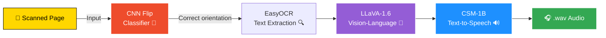

<!-- ===== HEADER BANNER ===== -->
<div align="center">


[](https://pytorch.org/)
[](https://huggingface.co/)
[](https://github.com/JaidedAI/EasyOCR)
[](https://dvc.org/)
[](https://colab.research.google.com/)
[](#)


</div>

---

## 🧠 What It Does

A **multi-modal AI pipeline** that transforms scanned book pages into spoken audio — combining computer vision, OCR, large vision-language models, and text-to-speech synthesis into a single reproducible workflow.

> 🎯 **One command in, one `.wav` file out.** From a static scanned page to a fully narrated audio clip via `dvc repro`.

<table>
<tr>
<td width="50%">

### 1️⃣ Orient
Detect image orientation using a custom-trained **CNN classifier** (flip / notflip).

</td>
<td width="50%">

### 2️⃣ Extract
Pull text from the corrected image with **EasyOCR** + **LLaVA-1.6** vision-language model.

</td>
</tr>
<tr>
<td width="50%">

### 3️⃣ Synthesise
Generate natural-sounding speech from the extracted text using the **CSM-1B** model.

</td>
<td width="50%">

### 4️⃣ Output
Save a final **`.wav` audio file** — turning a static page into spoken content.

</td>
</tr>
</table>

---

## 🔁 Pipeline Flow



---

## 🗂️ Project Structure
---

## 🔧 Tech Stack

<div align="center">

| Component | Tool / Framework |
|:---|:---|
| 🖼️ **Image Classification** |  Custom CNN |
| 🔍 **OCR** |  |
| 🧠 **Vision-Language Model** |  (HuggingFace) |
| 🔊 **Text-to-Speech** |  (HuggingFace) |
| ⚙️ **Pipeline Versioning** |  +  |
| 🎨 **Data Augmentation** |  transforms |
| 📊 **Evaluation** |  |
| ☁️ **Environment** |  +  |

</div>


<table>
<tr>
<td width="50%">

### ⚙️ Training Config
- **Optimiser:** Lion (`lion-pytorch`)
- **Learning rate:** `3e-4`
- **Early stopping:** patience = 2
- **Batch size:** 64
- **Image size:** 96×96
- **Max epochs:** 50

</td>
<td width="50%">

### 🎨 Augmentation
- `RandomHorizontalFlip`
- `RandomRotation`
- `ColorJitter`
- Normalisation to ImageNet stats

</td>
</tr>
</table>

---

## ⚙️ DVC Pipeline Stages

```yaml
stages:
  ocr:
    cmd: python src/run_ocr.py
    deps: [src/run_ocr.py, data/raw/page.jpg]
    outs: [data/processed/ocr_result.json]
  test:
    cmd: python src/test_ocr.py
    deps: [src/test_ocr.py, data/processed/ocr_result.json]
```

Reproduce the full pipeline with one command:

```bash
dvc repro
```

---

## 🚀 Getting Started

### 1️⃣ Clone the repo
```bash
git clone https://github.com/your-username/book-pipeline.git
cd book-pipeline
```

### 2️⃣ Install dependencies
```bash
pip install -r requirements.txt
```

### 3️⃣ Add your input image

---

## 🏗️ Model Architecture — Flip Classifier

A custom **4-block CNN** built in PyTorch to classify whether an input image is correctly oriented before passing it downstream.
### 4️⃣ Run the pipeline
```bash
dvc repro
```

### 5️⃣ Play the output audio

---

## ✅ Tests

Unit tests validate that OCR outputs exist and are non-empty:

```bash
python src/test_ocr.py
```

---

## 📊 Evaluation — Flip Classifier

Model performance is evaluated on a held-out test set using:

<table>
<tr>
<td width="33%" align="center">

### 📋 Classification Report
Precision · Recall · F1-score per class

</td>
<td width="33%" align="center">

### 🟦 Confusion Matrix
Seaborn heatmap of predictions vs. truth

</td>
<td width="33%" align="center">

### 📈 ROC Curve
AUC score + threshold analysis

</td>
</tr>
</table>

---

## 📋 Requirements


