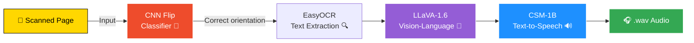

<!-- ===== HEADER BANNER ===== -->

---

## 🧠 What It Does

A **multi-modal AI pipeline** that transforms scanned book pages into spoken audio — combining computer vision, OCR, large vision-language models, and text-to-speech synthesis into a single reproducible workflow.

> 🎯 **One command in, one `.wav` file out.** From a static scanned page to a fully narrated audio clip via `dvc repro`.

<table>
<tr>
<td width="50%">

### 1️⃣ Orient
Detect image orientation using a custom-trained **CNN classifier** (flip / notflip).

</td>
<td width="50%">

### 2️⃣ Extract
Pull text from the corrected image with **EasyOCR** + **LLaVA-1.6** vision-language model.

</td>
</tr>
<tr>
<td width="50%">

### 3️⃣ Synthesise
Generate natural-sounding speech from the extracted text using the **CSM-1B** model.

</td>
<td width="50%">

### 4️⃣ Output
Save a final **`.wav` audio file** — turning a static page into spoken content.

</td>
</tr>
</table>

---

## 🔁 Pipeline Flow

---

## 🗂️ Project Structure
